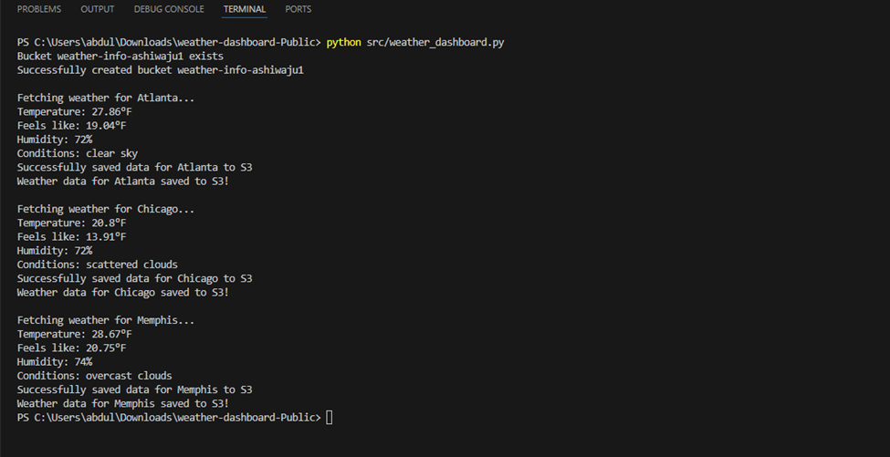

# 30 Days DevOps Challenge - Weather Dashboard

Day 1: Building a weather data collection system using AWS S3 and OpenWeather API

# Weather Data Collection System - DevOps Day 1 Challenge

## Project Overview
This project is a Weather Data Collection System that demonstrates core DevOps principles by combining:
- External API Integration (OpenWeather API)
- Cloud Storage (AWS S3)
- Infrastructure as Code
- Version Control (Git)
- Python Development
- Error Handling
- Environment Management

## Features
- Fetches real-time weather data for multiple cities
- Displays temperature (°F), humidity, and weather conditions
- Automatically stores weather data in AWS S3
- Supports multiple cities tracking
- Timestamps all data for historical tracking

## Technical Architecture
- **Language:** Python 3.x
- **Cloud Provider:** AWS (S3)
- **External API:** OpenWeather API
- **Dependencies:** 
  - boto3 (AWS SDK)
  - python-dotenv
  - requests

```markdown
## Project Structure
weather-dashboard/
  src/
    __init__.py
    weather_dashboard.py
  tests/
  data/
  .env
  .gitignore
  requirements.txt

## Setup Instructions
1. Clone the repository:
--bash
git clone https://github.com/sabdulramoni2/weather-dashboard-Public.git

3. Install dependencies:
pip install -r requirements.txt


4. Configure environment variables (.env):
CopyOPENWEATHER_API_KEY=your_api_key
AWS_BUCKET_NAME=your_bucket_name

4.Configure AWS credentials:
aws configure


5. Run the application:
python src/weather_dashboard.py




6. Verify data is stored in S3 bucket


What I Learned

AWS S3 bucket creation and management
Environment variable management for secure API keys
Python best practices for API integration
Git workflow for project development
Error handling in distributed systems
Cloud resource management

Future Enhancements

Add weather forecasting
Implement data visualization
Add more cities
Create automated testing
Set up CI/CD pipeline
